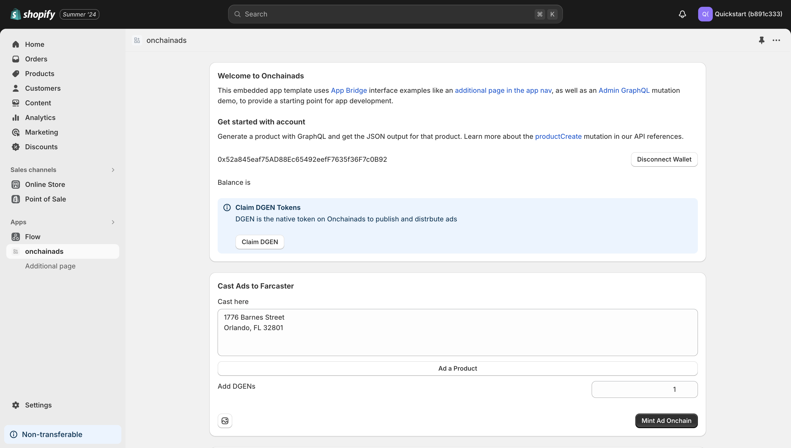
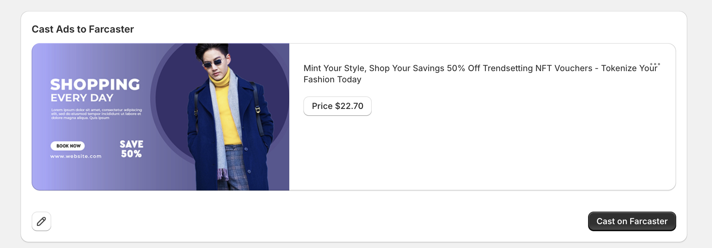
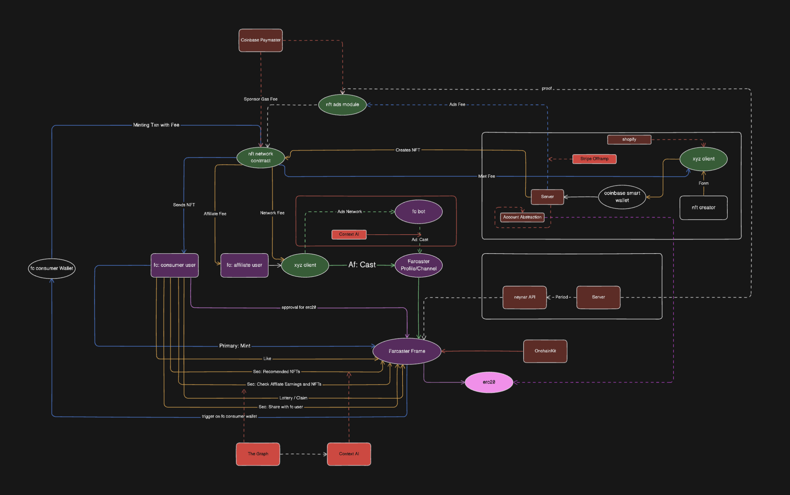

# Onchainads

Onchain Summer Hack Project 2024

### Quick intro about our project:

The digital content marketplace is undergoing a seismic shift, with millions of creations now sold as NFTs or RWAs. This transformation is coupled with a growing preference for cryptocurrency payments among consumers. However, Shopify merchants find themselves at a crossroads, unable to fully capitalize on this burgeoning market due to a critical lack of Web3 integration.

Shopify's e-commerce platform, while robust for traditional online sales, lacks the necessary tools to tokenize digital goods or accept cryptocurrencies seamlessly. This technological gap has left merchants unable to tap into the expanding crypto-native audience, exemplified by platforms like Farcaster with its 500,000+ engaged Web3 users.

The problem is twofold: Shopify merchants can't offer their digital content in formats preferred by Web3 users, nor can they effectively reach and engage this crypto-savvy audience. This disconnect is causing merchants to miss out on a significant market opportunity and limiting their competitiveness in the evolving digital content landscape. Bridging this divide is crucial for Shopify merchants to remain relevant and thrive in the Web3 era, allowing them to unlock new revenue streams and connect with a financially potent user base that values direct creator-to-consumer relationships and blockchain-based ownership.

OnChainAds bridges this gap with a comprehensive Web3 solution. Our stack enables Shopify merchants to create on-chain wallets effortlessly using their passkeys via Coinbase Smart Wallet, eliminating complex setups. Merchants can then create blockchain-based ads for their digital content, including tokenized goods and NFTs, which are automatically topped up with native DG tokens. This innovation ensures ads have built-in value and liquidity on the blockchain.

The platform facilitates ad distribution on Farcaster, reaching crypto-native audiences directly. It integrates seamless crypto payment processing, aligning with Web3 user preferences. A key feature is the decentralized affiliate network, allowing Farcaster users to recast ads to their followers and earn revenue, creating a self-sustaining ecosystem of content distribution.

Whenever Farcaster users engage with these promoted ads by clicking on them, we track the Click-Through-Rate (CTR) to gather analytics. Based on this engagement data, a fee is calculated and processed through our registered smart contracts on Base.

### Target Audience: 
* NFT creators wanting to sell digital art, collectibles, or utility tokens with Shopify
* Businesses using Shopify for tokenizing real-world assets (e.g., real estate, commodities, luxury goods)
* Web3 users seeking trustworthy e-commerce experiences with crypto payment options

### Overview of Architecture

### Contracts addresses on base sepolia testnet

1. DeGen - 0x76160579627CD45Ba88f23E5919C61444AF53D5A
2. Airdrop - 0x868c539269b3Cc51B00b34D3294c25Fc09cCd06c
3. OnChainAd - 0xa5d88f17AB42Cbe9EF68177a815D218c1DE650AD

### Running Application

1. Install Shopify Command Lines

https://shopify.dev/docs/api/shopify-cli

2. Create a partner account on Shopify

https://www.shopify.com/partners?shpxid=4b9babc3-1E88-438C-AA61-E6CDD1646858

3. Install Cloudflare locally

4. Run Cloudflare tunner locally

cloudflared tunnel --url http://localhost:3000

5. Run Shopify app platform locally with tunner flag

shopify app dev --tunnel-url [_tunner_url_on_port_3000_]
